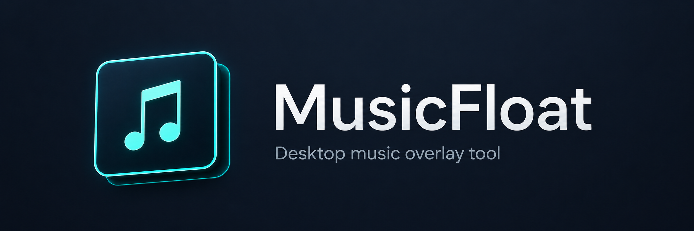

<p align="center">
  
</p>

<h1 align="center">MusicFloat</h1>

<p align="center">
  一款轻量的 Windows 音乐悬浮窗工具，支持 SMTC、歌曲信息自定义、快捷键和手柄控制。
</p>

<p align="center">
  <a href="LICENSE"></a>
  
  
</p>

<p align="center">
  <a href="README.md">English</a> | 简体中文
</p>

MusicFloat 是一款本地 Windows 桌面应用，面向能够通过 Windows System Media Transport Controls（SMTC）提供媒体信息的播放器。它可以显示紧凑的音乐悬浮窗、控制播放，并且不会进入游戏进程：不注入、不使用 DirectX Hook、不使用驱动级覆盖层，也不修改其他进程。

为了兼容现有代码结构，项目命名空间仍为 `AppleMusicOverlay`；默认构建和正式发布包都会生成 `MusicFloat.exe`。

## 预览

MusicFloat 提供深色桌面控制面板，包含当前播放、悬浮窗设置、快捷键和常用选项页面。悬浮窗会显示封面、歌名、歌手；使用 Apple Music Windows App 或网易云音乐时，还会显示当前歌曲的收藏状态。

## 功能

- 通过 Windows SMTC 读取歌名、歌手、播放状态、媒体来源和封面。
- 切歌时或手动触发时显示悬浮窗。
- 可以关闭切歌时自动弹出悬浮窗，同时保留手动显示快捷键。
- 支持设置悬浮窗显示方式、显示时长、大小、位置、阴影、歌名和歌手显示状态，以及歌曲信息字体。
- 支持上一首、下一首、播放/暂停和显示当前歌曲悬浮窗的键盘与手柄快捷键。
- MusicFloat 的同一个键盘或手柄“收藏当前歌曲”动作会按播放源自动分流：Apple Music 只添加收藏；网易云音乐转发其“喜欢歌曲”全局快捷键，重复调用可在喜欢和取消喜欢之间切换。
- 快捷键页面最下方的“网易云收藏联动”可以通过“组合键 + 主键”选择网易云的全局“喜欢歌曲”按键；它必须与网易云音乐设置一致，并且只作为转发目标，不会被 MusicFloat 注册。
- 能识别 Apple Music 歌曲已经收藏，不会取消收藏，也不会重复切换星标。
- 在悬浮窗中显示 Apple Music 和网易云音乐的收藏状态。
- 使用网易云音乐自带的“喜欢歌曲”全局快捷键或喜欢按钮时，由网易云完成真实歌单操作，MusicFloat 会在本地状态确认后播放同款星标动效；网易云快捷键可以由用户自行改键。
- 网易云音乐不会使用可能延迟或低清的 SMTC 缩略图；MusicFloat 会按歌曲身份从本地播放列表安全定位官方 CDN 封面，只显示实际尺寸至少为 400px 的官方原图，并预取播放队列后续 4 首。这个门槛可兼容网易云部分最高只有 430px 的旧专辑封面，同时仍会拒绝明显低清的缩略图。切歌时会等待当前歌曲经过验证的高清封面，使封面、歌名、歌手和收藏状态完整同步出现，不会复用上一首或低清封面。
- 当系统中存在多个 SMTC 媒体会话时，可以选择抓取源；首次启动默认为“自动选择”。所选来源关闭后，运行时悬浮窗会停止显示旧歌曲，不受常驻模式影响。
- 支持托盘驻留和关闭到托盘。
- 只读取系统已安装字体。MusicFloat 不内置、不下载、不复制，也不重新分发 Spotify Mix、Apple SF Pro 或其他专有字体。

## 下载

请在 [GitHub Releases](https://github.com/Adudumax/MusicFloat/releases/latest) 页面下载最新的 Windows x64 便携版。

MusicFloat 本身不需要安装程序，但必须先安装 .NET 8 Desktop Runtime（x64）。

微软官方下载页面：https://dotnet.microsoft.com/en-us/download/dotnet/8.0/runtime

打开页面后，请选择 **.NET Desktop Runtime 8.x - Windows x64**。

## 快速开始

1. 如果尚未安装 .NET 8 Desktop Runtime（x64），请先安装。
2. 下载最新的 `MusicFloat-vX.Y.Z-win-x64.zip` 发布资产。
3. 将 ZIP 解压到你自己的文件夹。
4. 运行 `MusicFloat.exe`。
5. 在支持 SMTC 的播放器中开始播放音乐。
6. 在控制面板中刷新来源、测试悬浮窗、调整悬浮窗设置并绑定快捷键。

## 键盘和手柄控制

MusicFloat 支持为以下操作配置键盘和手柄快捷键：

- 上一首
- 下一首
- 播放 / 暂停
- 显示当前歌曲悬浮窗
- 收藏 Apple Music Windows App 当前歌曲

手柄支持取决于设备能否通过 Windows 游戏手柄 API 正常提供输入。快捷键冲突检测、替换和自动保存均由应用处理。

## 从源码构建

要求：

- Windows 10 1809 或更新版本，或 Windows 11
- .NET 8 SDK

构建和测试：

```powershell
dotnet restore AppleMusicOverlay.sln
dotnet build AppleMusicOverlay.sln
dotnet test tests/AppleMusicOverlay.Tests/AppleMusicOverlay.Tests.csproj
```

从源码运行：

```powershell
dotnet run --project src/AppleMusicOverlay/AppleMusicOverlay.csproj
```

创建名为 `MusicFloat.exe` 的 Windows x64 framework-dependent 单文件版本：

```powershell
dotnet publish src/AppleMusicOverlay/AppleMusicOverlay.csproj `
  -c Release `
  -r win-x64 `
  --self-contained false `
  -p:PublishSingleFile=true `
  -p:PublishTrimmed=false `
  -p:DebugType=None `
  -p:DebugSymbols=false
```

## 已知限制

- MusicFloat 依赖 Windows SMTC。如果 Windows 没有为某个播放器提供媒体会话，MusicFloat 就无法读取或控制它。
- 媒体信息质量取决于播放器。有些播放器可能提供缺失、延迟或较泛化的歌名、歌手和封面信息。
- 悬浮窗是普通 Windows 桌面窗口，不会注入游戏，在独占全屏模式下可能不可见。
- 可选歌曲信息字体只有在用户系统中已经安装时才会显示。
- Apple Music 收藏依赖应用的 Windows UI Automation 辅助功能树，因为 SMTC 本身不提供收藏操作。
- Apple Music 必须保持运行并已登录，才能检测收藏状态和执行收藏操作。
- 网易云音乐必须保持运行、已登录并开启 SMTC 和全局快捷键。MusicFloat 的“网易云收藏联动”必须与网易云音乐设置一致；默认是 `Ctrl+Alt+L`。真实的喜欢或取消喜欢由网易云完成，随后 MusicFloat 回读“我喜欢的音乐”确认结果。

## 许可证

MusicFloat 使用 `GPL-3.0-only` 许可证发布。详见 [LICENSE](LICENSE)。
